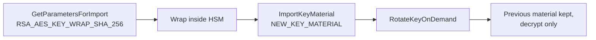

# aws-kms-external-key-rotation

Rotating KMS keys whose material comes from an on-premise HSM, and proving afterwards that nothing was missed.

## Automatic rotation does not apply

A key with `Origin=EXTERNAL` cannot use automatic rotation. That rules out the obvious answer and also breaks the obvious audit: the managed rule `cmk-backing-key-rotation-enabled` checks whether automatic rotation is on, so it reports every imported-material key as non-compliant however well it is run.

What these keys do support is [on-demand rotation](https://docs.aws.amazon.com/kms/latest/developerguide/rotating-keys-on-demand.html), and the details matter because they remove most of the expected work. The key ID and ARN do not change. Previous material is retained and stays valid for decrypt; only the current material encrypts.

So rotation needs no re-encryption. That is the difference between a compliance task and a migration, because rekeying by alias swap costs this instead:

| Service | Rekeying an existing resource |
|---|---|
| DynamoDB | Swap in place, background re-encrypt |
| S3 | No per-object rekey, needs an S3 Batch Operations copy |
| RDS | Key is fixed at creation. Snapshot, copy, restore, cut over |

The RDS row is why alias swapping is the wrong plan.

## Ceremony



```
rotate.py --key-id <id> --get-parameters ./out
rotate.py --key-id <id> --wrapped-material wrapped.bin --import-token out/import_token.bin
rotate.py --key-id <id> --rotate
```

The script never touches plaintext material. It fetches the wrapping public key, the HSM wraps, and the script imports the result. Run the import over a KMS interface endpoint so it does not cross the internet, and keep CloudTrail on it.

## Constraints to plan around

**25 on-demand rotations per key, permanently.** Annual gives 25 years, quarterly about 6. When the budget is spent the only path is a new key, and that is when the table above finally applies. `--status` reports how many remain.

The import token is valid for 24 hours, so the HSM ceremony finishes inside that window or starts again from `GetParametersForImport`.

**Durability is yours.** AWS holds no copy it can restore. If material expires or is deleted the key is dead until the same material is re-imported, so the HSM copy and its own backup are part of the recovery plan, not an afterthought. Multi-Region replicas do not inherit material either: the same bytes have to be imported into each one.

## Detecting drift

The custom rule resolves the key behind each RDS instance, DynamoDB table and S3 bucket, reads `ListKeyRotations`, and compares the newest rotation against `MAX_KEY_AGE_DAYS`. Non-compliant covers never rotated, rotated too long ago, and not a customer managed key.

It handles both invocation types. Change notifications carry a configuration item; scheduled runs do not, so those enumerate resources through Config and batch results in groups of 100. Aggregate into the security account and surface through Security Hub rather than checking per account.

The tradeoff is ownership: this is code the team maintains, because no managed rule answers the question for imported-material keys.

## Running it

```
rotation/     rotate.py
config-rule/  handler.py
terraform/    rule, evaluation function, IAM
```

```
cd terraform
terraform init -backend=false
terraform validate
```
