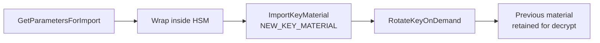

# aws-kms-external-key-rotation

Rotating KMS keys whose material comes from an on-premise HSM, and proving afterwards that nothing was missed.

## Automatic rotation is not available here

A key created with `Origin=EXTERNAL` cannot use automatic rotation. That rules out the obvious answer and it also breaks the obvious audit: the managed Config rule `cmk-backing-key-rotation-enabled` checks whether automatic rotation is enabled, so it reports every imported-material key as non-compliant no matter how well it is managed.

What these keys do support is [on-demand rotation](https://docs.aws.amazon.com/kms/latest/developerguide/rotating-keys-on-demand.html). It is worth being precise about what that changes, because it removes most of the work people expect.

The key ID and ARN stay the same. Previous key material is retained and stays valid for decrypt; only the current material is used for encrypt. So rotation does not require re-encrypting anything.

That last point matters more than it sounds. The alternative approach, creating a new key and re-pointing the alias, means every existing ciphertext still needs the old key, and the cost lands unevenly:

| Service | Rekeying an existing resource |
|---|---|
| DynamoDB | Key can be swapped in place, background re-encrypt |
| S3 | No per-object rekey. Needs an S3 Batch Operations copy job |
| RDS | Key is fixed at creation. Snapshot, copy with the new key, restore, cut over |

On-demand rotation avoids all three. The RDS row is the reason: rotating by alias swap turns a compliance task into a migration with downtime.

## The ceremony



```
rotate.py --key-id <id> --get-parameters ./out
# wrap the material in the HSM using out/wrapping_public_key.bin
rotate.py --key-id <id> --wrapped-material wrapped.bin --import-token out/import_token.bin
rotate.py --key-id <id> --rotate
```

The script never handles plaintext key material. It fetches the wrapping public key, the HSM does the wrapping, and the script imports the resulting blob.

Wrapping uses `RSA_AES_KEY_WRAP_SHA_256` over an `RSA_4096` wrapping key. The envelope scheme is the right choice for 256-bit material, and doing the wrap inside the HSM means the material never exists in the clear outside it. Run the import over a KMS interface VPC endpoint so it does not traverse the internet, and log the whole thing through CloudTrail.

## Constraints worth planning around

**25 on-demand rotations per key, ever.** Annual rotation gives 25 years, quarterly gives about 6. When the budget runs out the only path is a new key, and that is when the migration table above finally applies. Worth knowing at design time rather than at rotation 25.

**The import token expires.** Parameters are valid for 24 hours, so the HSM ceremony has to complete inside that window or start again.

**Durability is yours.** AWS does not hold a copy it can restore from. If material expires or is deleted the key is unusable until the same material is re-imported, so the HSM copy and its own backup are part of the recovery plan.

**Multi-Region keys need the same material imported into every replica.** They do not inherit it from the primary.

## Detecting drift

```
terraform/     Config rule, evaluation function, IAM
config-rule/   handler.py
rotation/      rotate.py
```

The custom rule resolves the KMS key behind each RDS instance, DynamoDB table and S3 bucket, reads `ListKeyRotations`, and compares the most recent rotation date against `MAX_KEY_AGE_DAYS`. A resource is non-compliant if its key was never rotated, was rotated too long ago, or is not a customer managed key at all.

It runs on configuration change and on a daily schedule, so a resource created between evaluations does not sit unnoticed until the next sweep. Aggregate the results into the security account with a Config aggregator and surface them through Security Hub rather than checking per account.

The tradeoff: this is a custom rule, so it is code the team now owns and has to maintain alongside the AWS-managed ones. The alternative is accepting that no managed rule answers the question for imported-material keys.
